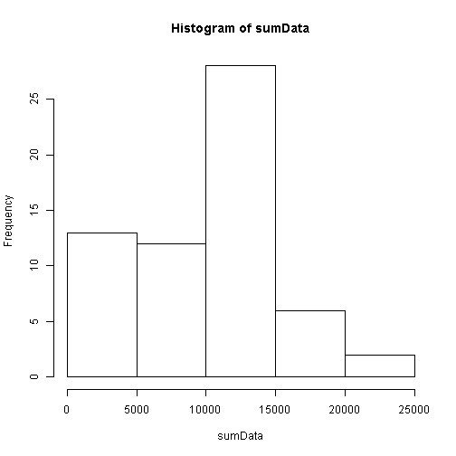

# Reproducible Research: Peer Assessment 1


## Loading and preprocessing the data
Loading required libraries

```r
library(ggplot2)
```

Downloading data

```r
setwd("d:/DEV/R/Learning")
fileUrl = "https://d396qusza40orc.cloudfront.net/repdata%2Fdata%2Factivity.zip"
if (!file.exists("gettingData")) {
    dir.create("gettingData")
}
setwd("d:/DEV/R/Learning/gettingData")
download.file(fileUrl, destfile = "activity.zip", method = "auto")
```

```
## Error: unsupported URL scheme
```

```r
list.files(".//gettingData")
```

```
## character(0)
```

```r
activityDateDownloaded = date()
```


Loading activities data and changing  the date into a format suitable for our analysis:

```r
activities = read.csv(unz(description = "activity.zip", "activity.csv"), sep = ",")
str(activities)
```

```
## 'data.frame':	17568 obs. of  3 variables:
##  $ steps   : int  NA NA NA NA NA NA NA NA NA NA ...
##  $ date    : Factor w/ 61 levels "2012-10-01","2012-10-02",..: 1 1 1 1 1 1 1 1 1 1 ...
##  $ interval: int  0 5 10 15 20 25 30 35 40 45 ...
```

```r
activities$date = as.Date(activities$date, format = "%Y-%m-%d")
```


## What is mean total number of steps taken per day?

```r
sumData = tapply(activities$steps, factor(activities$date), sum, na.rm = TRUE)
hist(sumData)
```

 

```r
mean(sumData, na.rm = TRUE)
```

```
## [1] 9354
```

```r
median(sumData, na.rm = TRUE)
```

```
## [1] 10395
```


## What is the average daily activity pattern?


## Imputing missing values


## Are there differences in activity patterns between weekdays and weekends?


